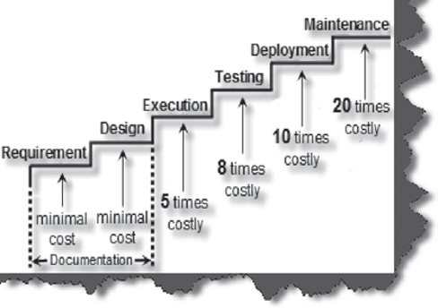

# Flutter Testing Guide

## Introduction

Tests are an essential part of software development. They help developers to verify the functionality of the code they write and ensure that it behaves as expected. Testing is a process of executing a program with the intent of finding errors. In Flutter, testing is an essential part of the development process, and it's critical to write high-quality tests that cover all corner cases.

## Why do we need tests?

Tests ensure that the code you write works as intended. They help to catch bugs early in the development process, which saves time and effort in the long run. Writing tests also makes the code more reliable and maintainable. 

The cost of removing defects increases exponentially. A defect caught in requirement and design phase costs less to fix than an error caught in the software maintenance cycle.



## How to cover all the corner cases?

To ensure that your tests cover all corner cases, you should consider the different input values and edge cases that your code might encounter. For example, if you are testing a function that performs a calculation, you should test it with different input values, including negative numbers, zero, and large numbers.

It's also a good idea to use boundary testing, where you test the boundaries between different input values. For example, if your function takes an input between 0 and 100, you should test it with values of 0, 1, 99, 100, and values just above and below these boundaries.

## How to start with Flutter Testing?

1. Add the `flutter_test` package to your `pubspec.yaml` file
2. Create a new test file in your project's `test` directory. The file should have the same name as the file you want to test, with `_test` appended to the end. For example, if you want to test a file called `my_widget.dart`, the test file should be called `my_widget_test.dart`.
3. Write test cases for the functions, widgets, or other parts of your application that you want to test. Use the tools provided by the flutter_test package, such as the test() and expect() functions, to define your test cases.
4. Run your tests using the flutter test command. This will run all the tests in your project's test directory.

### Basic Example

Suppose you have a `Calculator` class with a `add` method that takes two integers and returns their sum:

```dart
class Calculator {
  int add(int a, int b) {
    return a + b;
  }
}
```
To write a test for the `add` method, you can create a new file called `calculator_test.dart` in the same directory as your `calculator.dart` file, and write the following code:

```dart
import 'package:flutter_test/flutter_test.dart';
import 'package:my_app/calculator.dart';

void main() {
  test('Calculator add method', () {
    final calculator = Calculator();
    final result = calculator.add(2, 3);
    expect(result, 5);
  });
}
```
This test imports the `flutter_test` package, which provides the test function for writing tests, and imports the `Calculator` class from `calculator.dart`. The test function takes a string description of the test (in this case, "Calculator add method"), and a closure that contains the actual test code.

Inside the closure, we create a new instance of the `Calculator` class, call its `add` method with the arguments 2 and 3, and store the result in a variable called `result`. We then use the expect function to `assert` that the value of `result` is equal to `5`.

To run this test, you can run the following command in your terminal:

```bash
flutter test
```

This will run all the tests in your project, including the `Calculator add` method test we just wrote. If the test passes, you should see the following output in your terminal:

```bash
00:00 +1: All tests passed!
```
If the test fails (for example, if the add method in calculator.dart was implemented incorrectly), you will see an error message in your terminal indicating what went wrong.
