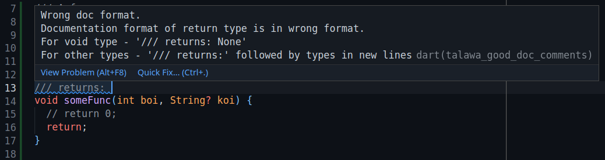
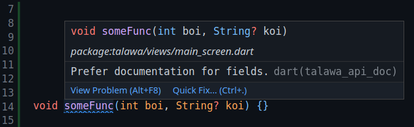

## Talawa Lint

`talawa_lint` is Talawa's custom lint rule set that we enforced to ensure
proper documentation for our codebase. It is a mini package that lives as a
sub-directory in `talawa` package.

### Proper Installation

Since `talawa_lint` is a package in itself, it has its own dependencies which
should be installed. To do so, go to `talawa` directory, then:

```bash
cd talawa_lint
flutter pub get
cd ..
flutter pub get
```

This will install all the required dependencies properly.
Sometimes (highly unlikely), you may get `Conflicting plugin version` error. In that
case you will need to clean your dev environment of `talawa` and reinstall packages.
To do so, go to `talawa` directory, then:

```bash
flutter clean
cd talawa_lint
flutter clean
flutter pub get
cd ..
flutter pub get
```

This should resolve the conflicting issues.

### Usage

If the installation was successful, you will be able to get lint warnings/errors right
in your IDE, as well as analyze your files from command line.

#### In IDE

With proper installation, you will get lint warnings if either your fields don't have any
documentation, or the documentation is not in the right format. Something like this



#### Command line

Run `flutter pub run custom_lint` in `talawa` root directory to analyze all of the files
for custom lint rules.

#### Logs

Logs are generated for our custom lint analysis in the file named `custom_lint.log`. This file
exists under both `talawa` and `talawa_lint` directories. You can find any error related to
`talawa_lint` integration in these logs. This comes handy while troubleshooting.

## Talawa Lint Rules

For now, we enforce two custom lint rules to our codebase, which should be strictly followed
by each file and their fields (classes, methods, attributes, getters, setters, top level variables,
functions, enums.......).<br></br>
The rules being.

1. `talawa_api_doc`
2. `talawa_good_doc_comments`

### talawa_api_doc

This lint rule checks for presence of documentation comment for any field. You will get a warning
as shown here



Note that a documentation comment is different from a normal comment as in normal comment starts
with `//` whereas doc comment starts with `///`.

### talawa_good_doc_comments

This is where the fun lies. This lint rule checks if the documentation provided for a field is in
the format that we expect. The format being:

#### For non function/method/getter/setter (classes, enums, variables etc)

1. First line of documentation must be a complete line ending with end punctuation (`.`, `!`, `?`)
2. If you think that there should be more to the documentation, leave the second line empty and write
   further documentation in paragraph fashion from the next line.

Examples of valid documentation include:

##### Single line

```js
/// This is my class and it does stuff.
class MyClass {}
```

##### Multi line

```js
/// This is my class and it does stuff.
///
/// The stuff includes playing pong with
/// my chip-8 emulator.
class MyClass {}
```

#### For functions and methods

Same rules as for non functions/methods as described above, in conjunction with two other
sections for `**params**:` and `**returns**:`

1. Follow same rules as described in the above section.
2. Add `/// **params**:` block. This marks the beginning of `params` section where you describe all the parameters
   that this function takes from the next line. The format being
   - `` /// * `param_name`: `` followed by its description starting in the same line.
   - The description can be multi line and requires no extra formatting.
   - If the function takes no parameters, `/// **params**:` should be followed by `///   None` in the next line.
3. After documenting all of the parameters, add `/// **returns**:` block. Note that there must be a blank line `///` between
   the `**params**` and `**returns**` blocks.
4. Followed by returns:
   - Add `` /// * `return_type`: `` followed by its description starting in the same line.
   - The description can be multi line and requires no extra formatting.
   - If the function returns void, `/// **returns**:` should be followed by `/// None` in the next line.
     Note that `Future<void>` is different from void. `///   None` is strictly used only for `void` type.

Examples of valid documentation include:

##### No parameter and void return

```js
/// My fun.
///
/// Other description.
///
/// **params**:
///   None
///
/// **returns**:
///   None
void fun () {}
```

##### Has parameter(s) and void return

```js
/// My fun.
///
/// Other description.
///
/// **params**:
/// * `name`: description
/// * `age`: description
///
/// **returns**:
///   None
void fun (String? name, int age) {}
```

##### No parameter and non-void return

```js
/// My fun.
///
/// Other description.
///
/// **params**:
///   None
///
/// **returns**:
/// * `int`: Answer of life.
int fun () {
    return 42;
}
```

##### Has parameter(s) and non-void return

```js
/// My fun.
///
/// Other description.
///
/// **params**:
/// * `name`: description
/// * `age`: description
///
/// **returns**:
/// * `int`: Answer of life.
int fun (String? name, int age) {
    return 42;
}
```

:::note

1. The `params:` block expects the **name** of the parameter and **not its type**.
2. The `returns:` block expects the **type** of the parameter and **not its name**.

:::
