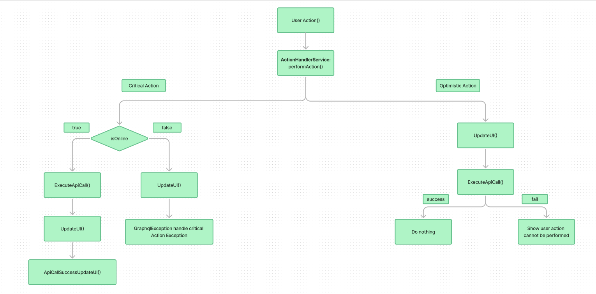

The **ActionHandlerService** provides a standardized way to handle both optimistic and critical user actions within the application, ensuring that they are executed consistently, regardless of whether the user is online or offline. This documentation outlines the flow of the `performAction` method, with detailed step-by-step explanations for both optimistic and critical actions.

The service focuses on:

- **Optimistic actions**: These actions immediately update the UI, assuming that the API call will succeed.
- **Critical actions**: These actions wait for the API call to succeed before updating the UI. They are important actions that require confirmation from the server.

## Key Features:

- Handles API calls with extensive error handling and optional UI updates.
- Supports optimistic and critical actions with distinct UI behaviors.
- Provides hooks for handling valid results, exceptions, and final tasks after API execution.

---

## **ActionHandlerService PerformAction Flow**



### 1. User Initiates an Action

The user triggers an action in the app, such as liking a post, commenting, or creating/deleting an event. Each action is routed through the **performAction** method of the `ActionHandlerService`, which wraps the action with logic to handle network status, UI updates, and error management.

---

### 2. Wrapping Actions with ActionHandlerService

The `performAction` method serves as a central point for managing all user actions. It handles:

- UI updates for optimistic actions.
- Network state detection.
- Executing API calls asynchronously.
- Offline behavior management, including retries for actions.

---

### 3. Action Type Decision

The `performAction` method categorizes actions as either **optimistic** or **critical**:

- **Optimistic Actions**: These actions (e.g., liking or commenting on a post) allow immediate UI feedback to the user before confirmation from the server.
- **Critical Actions**: These actions (e.g., creating or deleting a post) require reliable server interaction and will only update the UI after the server response.

---

### 4. Handling Optimistic Actions

#### i. UI Update Prior to API Call

For optimistic actions, the UI is updated immediately after the action is performed, giving the user instant feedback. For example, when a user likes a post, the like button changes to the "liked" state.

#### ii. Execute API Call

After the UI update, the `executeApiCall` method is called asynchronously to send the action request to the server.

#### iii. Post-API Behavior

- **Success Case**: If the API call succeeds, the UI is already updated, so no further action is required.
- **Failure Case**: If the API call fails (e.g., the user is offline), the user is notified that the action will be performed once the device is back online.

#### Error Handling for Optimistic Actions

In case of failure, optimistic actions should have robust error handling to notify the user and queue the action for later execution.

---

### 5. Handling Critical Actions

#### i. Check Network Status

The network status is checked before executing critical actions to determine whether the user is online or offline.

#### ia. Online Status

- **Execute API Call**: If the device is online, the `executeApiCall` method sends the request to the server.
- **Post-API UI Update**: Once the server confirms the action, the UI is updated accordingly (e.g., the new post appears in the feed).
- **ApiCallSuccess Callback**: After the API call completes, additional tasks like notifications or navigation are triggered via the success callback.

#### ib. Offline Status

If the device is offline, the user is notified, and no API call is made. The user is asked to retry once the device is connected to the internet.

---

### 6. The `executeApiCall` Method

The `executeApiCall` method is responsible for:

- **Asynchronous Network Request**: Sending the API request without blocking the UI.
- **Error Handling**: Managing network failures or server errors by informing the user or retrying the action.
- **Success Callback**: Triggering additional tasks after the API call completes successfully.

---

### 7. Optimizing for Offline-First Design

The `performAction` method is designed to accommodate offline scenarios:

- **Optimistic Actions**: The UI is updated before the server response to provide a seamless user experience.
- **Critical Actions**: API calls are only made when the device is online, ensuring data integrity.

---

### 8. Summary of Key Flows

- **Optimistic Actions**:
  - Immediate UI update followed by API call.
  - Error handling for failed API calls.
- **Critical Actions**:
  - Network status is checked before performing the action.
  - Online: API call, followed by UI update and success callback.
  - Offline: User is notified, and no action is taken.

---

### Methods:

#### `executeApiCall`

Executes an API action with appropriate error handling.

##### Parameters:

- `action`: A function that performs the API call and returns a `Future<QueryResult<Object?>?>`.
- `onValidResult`: A callback function that processes the API call result when it is successful.
- `onActionException`: A callback function that handles any exceptions that occur during the API call.
- `onActionFinally`: A callback function that executes regardless of the success or failure of the API call (typically used for cleanup tasks).

##### Returns:

- `Future<bool?>`: A boolean indicating the success (`true`), failure (`false`), or `null` if the result is invalid.

#### Usage Example:

```dart
final result = await actionHandlerService.executeApiCall(
  action: () async => await yourGraphqlClient.query(options),
  onValidResult: (result) async {
    // Handle valid result
  },
  onActionException: (e) async {
    // Handle exception
  },
  onActionFinally: () async {
    // Perform final cleanup or update UI
  },
);
```

### `performAction`

Executes a user action based on its type (`optimistic` or `critical`), updating the UI and handling errors accordingly.

#### Parameters:

- `actionType`: Specifies whether the action is optimistic or critical. (`ActionType.optimistic` or `ActionType.critical`).
- `action`: The action to perform, which returns a `Future<QueryResult<Object?>?>`.
- `onValidResult`: A callback function that processes the result when the action is successful.
- `onActionException`: A callback function that handles exceptions during the action.
- `updateUI`: A callback function to update the UI. For optimistic actions, it runs immediately; for critical actions, it runs after the API call.
- `apiCallSuccessUpdateUI`: A callback function to update the UI after a successful API call.
- `criticalActionFailureMessage`: A string for the error message used when a critical action fails.
- `onActionFinally`: A callback function to execute regardless of the success or failure of the action.

#### Returns:

- `Future<void>`

#### Usage Example:

```dart
await actionHandlerService.performAction(
  actionType: ActionType.optimistic,
  action: () async => await yourGraphqlClient.query(options),
  onValidResult: (result) async {
    // Handle valid result
  },
  onActionException: (e) async {
    // Handle exception
  },
  updateUI: () {
    // Immediately update UI for optimistic action
  },
  apiCallSuccessUpdateUI: () {
    // Update UI after API call success
  },
  criticalActionFailureMessage: 'Failed to save your action. Please try again.',
  onActionFinally: () async {
    // Perform final cleanup
  },
);
```

## Optimistic vs. Critical Actions

- **Optimistic actions** immediately update the UI before the API call is made. This improves perceived responsiveness, but the UI may need to be rolled back if the API call fails.
- **Critical actions** wait for a response from the server before updating the UI. This ensures that the UI reflects the actual state after the server confirms the action.

---

## Error Handling

The `ActionHandlerService` is designed to gracefully handle exceptions. For optimistic actions, the UI is updated before the API call, but if an error occurs, a rollback or UI adjustment might be needed. For critical actions, error messages are handled based on the type of error, and the UI is updated accordingly.

In case the device is offline, a **critical action** will trigger an exception with a user-friendly message, notifying the user that their action was not saved.

#### Example:

```dart
if (await connectivityViewModel.isOnline()) {
  await actionHandlerService.performAction(
    actionType: ActionType.critical,
    action: () async => await yourGraphqlClient.mutate(options),
    onValidResult: (result) async {
      // Handle valid mutation result
    },
    onActionException: (e) async {
      // Handle exception, such as showing an error message to the user
    },
    updateUI: () {
      // Update UI only after the API call for critical actions
    },
    apiCallSuccessUpdateUI: () {
      // Additional UI update on successful API call
    },
    criticalActionFailureMessage: 'Failed to save critical action. Please try again.',
    onActionFinally: () async {
      // Perform any final tasks after the API call
    },
  );
} else {
  // Handle the case where the device is offline
  showOfflineError();
}
```
