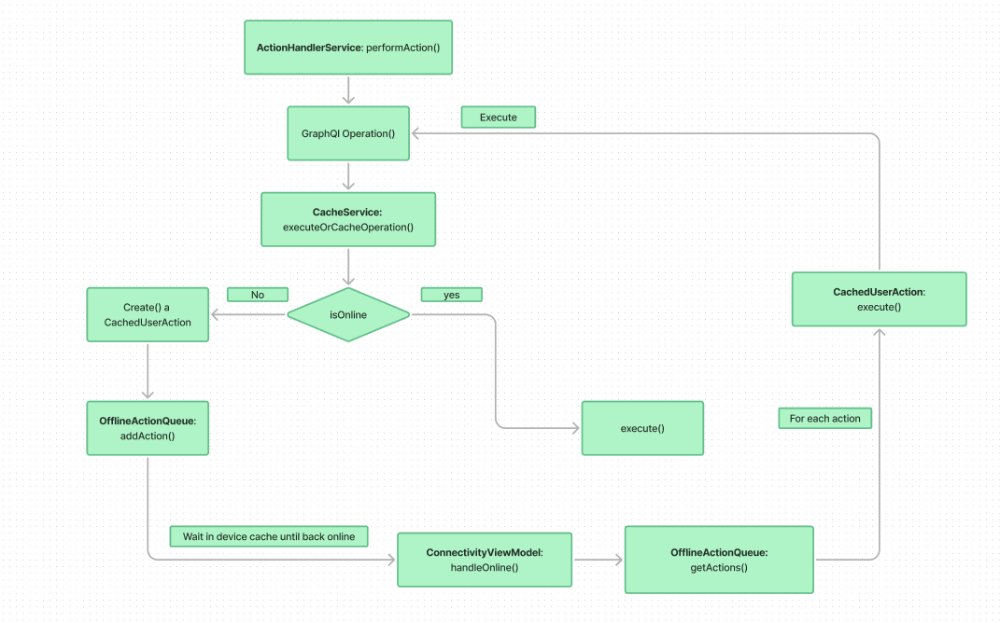

This document outlines the detailed process for managing user actions with GraphQL operations in scenarios where network connectivity can vary. The flow includes creating GraphQL operations, determining whether to execute or cache these operations based on network status, and handling offline scenarios by queuing actions and executing them once the device is back online.

## Flow-Breakdown



1. **User Action Initiation**

   - The flow begins when a user performs an action within the application. This action could involve interacting with UI elements, such as liking a post, creating an event, or any other activity that requires communication with a backend server.

2. **GraphQL Operation Creation**

   - Based on the user action, a GraphQL operation is created. This operation represents the request to be sent to the server to process the user’s action. The operation could be a mutation or query depending on the action performed.

3. **Determine Execution or Caching**

   - The `executeOrCacheOperation()` method of the `cacheService` is called to decide whether to execute the GraphQL operation immediately or cache it for later execution based on the device's network connectivity.

   - **3a. If the Device is Online:**

     - **i. Execute GraphQL Operation:**
       - The GraphQL operation is executed immediately. The `cacheService` sends the request to the server, and the response is processed accordingly. This ensures real-time processing and immediate feedback to the user.

   - **3b. If the Device is Offline:**

     - **i. Create Cached User Action:**

       - A `cachedUserAction` is created to represent the offline GraphQL operation. This object includes all necessary details of the operation, such as the operation type, variables, and any metadata required for execution.

     - **ii. Push to Offline Action Queue:**

       - The `cachedUserAction` is pushed to the `OfflineActionQueue`, a data structure designed to store actions that cannot be executed immediately due to the lack of network connectivity.

     - **iii. Wait Until Device is Back Online:**

       - The system continuously monitors network connectivity and waits until the device regains online status before proceeding to execute any actions in the `OfflineActionQueue`.

     - **iv. Process Offline Actions:**

       - When the device is back online, the application pops each action from the `OfflineActionQueue` and processes them. Actions are executed in the order they were added to the queue.

     - **v. Re-execute Actions:**
       - For each `cachedUserAction`, the system recreates the GraphQL operation and executes it as it was intended initially. This ensures that all user actions are processed, even if there were temporary connectivity issues.

## CachedUserAction Model Documentation

The `CachedUserAction` class represents a user action that is cached for offline use. This model is used to store actions when the device is offline, allowing them to be executed once the device is back online. This documentation covers the class's properties, methods, and usage.

### Overview

The `CachedUserAction` class provides the following functionalities:

- **Serialization:** Converts the object to and from JSON for easy storage and retrieval.
- **Execution:** Executes the cached user action based on its type, leveraging GraphQL operations.

### Properties

#### `id`

- **Type:** `String`
- **Description:** The unique identifier for the cached user action.
- **Hive Field:** `0`

#### `operation`

- **Type:** `String`
- **Description:** The GraphQL operation to be performed for the cached user action. This could be a mutation or a query.
- **Hive Field:** `1`

#### `variables`

- **Type:** `Map<String, dynamic>?`
- **Description:** The variables required for the GraphQL operation, if any.
- **Hive Field:** `2`

#### `timeStamp`

- **Type:** `DateTime`
- **Description:** The timestamp when the action was cached. This helps in managing the order of operations and expiration of cache.
- **Hive Field:** `3`

#### `status`

- **Type:** `CachedUserActionStatus`
- **Description:** The status of the cached user action, which indicates whether the action is pending, completed, or failed.
- **Hive Field:** `4`

#### `metaData`

- **Type:** `Map<String, dynamic>?`
- **Description:** Any additional metadata related to the cached user action. This could include information about the context or additional details relevant to the operation.
- **Hive Field:** `5`

#### `operationType`

- **Type:** `CachedOperationType`
- **Description:** The type of operation for the cached user action. This helps in determining how the operation should be executed (e.g., authenticated vs. non-authenticated queries or mutations).
- **Hive Field:** `6`

#### `expiry`

- **Type:** `DateTime`
- **Description:** The expiry date and time for the cached user action. Actions that have expired are generally not executed and may be purged from the cache.
- **Hive Field:** `7`

### Methods

#### `fromJson`

- **Description:** Creates a `CachedUserAction` instance from a JSON-compatible map.
- **Parameters:**
  - `json` (`Map<String, dynamic>`): A map representing the `CachedUserAction`.
- **Returns:**
  - `CachedUserAction`: A new instance of `CachedUserAction`.

#### `toJson`

- **Description:** Converts the `CachedUserAction` to a JSON-compatible map.
- **Parameters:**
  - None
- **Returns:**
  - `Map<String, dynamic>`: A map representing the `CachedUserAction`.

#### `toString`

- **Description:** Returns a string representation of the `CachedUserAction` instance.
- **Parameters:**
  - None
- **Returns:**
  - `String`: A string representation of the `CachedUserAction`.

#### `execute`

- **Description:** Executes the cached user action based on its operation type.
- **Parameters:**
  - None
- **Returns:**
  - `Future<QueryResult<Object?>>`: The result of the executed GraphQL operation. The result is wrapped in a `QueryResult` object, which includes details of the operation's success or failure.

#### Operation Types Handled

The `execute` method handles various GraphQL operations based on the `operationType`:

- **`gqlAuthQuery`:** Executes an authenticated GraphQL query.
- **`gqlAuthMutation`:** Executes an authenticated GraphQL mutation.
- **`gqlNonAuthQuery`:** Executes a non-authenticated GraphQL query.
- **`gqlNonAuthMutation`:** Executes a non-authenticated GraphQL mutation.
- **Default Case:** Returns `databaseFunctions.noData` if the operation type is unknown.

### Usage

The `CachedUserAction` class is used in scenarios where user actions need to be cached due to offline conditions. It helps ensure that user actions are not lost and can be executed later when the device is back online. The class supports both serialization for persistence and execution based on operation type.

#### Example Usage

```dart
// Creating a CachedUserAction
final action = CachedUserAction(
  id: 'unique-id',
  operation: 'mutation LikePost($postId: ID!) { likePost(postId: $postId) { id likes } }',
  variables: {'postId': '123'},
  timeStamp: DateTime.now(),
  status: CachedUserActionStatus.pending,
  metaData: {'source': 'user_action'},
  operationType: CachedOperationType.gqlAuthMutation,
  expiry: DateTime.now().add(Duration(days: 1)),
);

// Converting to JSON
final json = action.toJson();

// Creating from JSON
final newAction = CachedUserAction.fromJson(json);

// Executing the action
final result = await newAction.execute();
```
