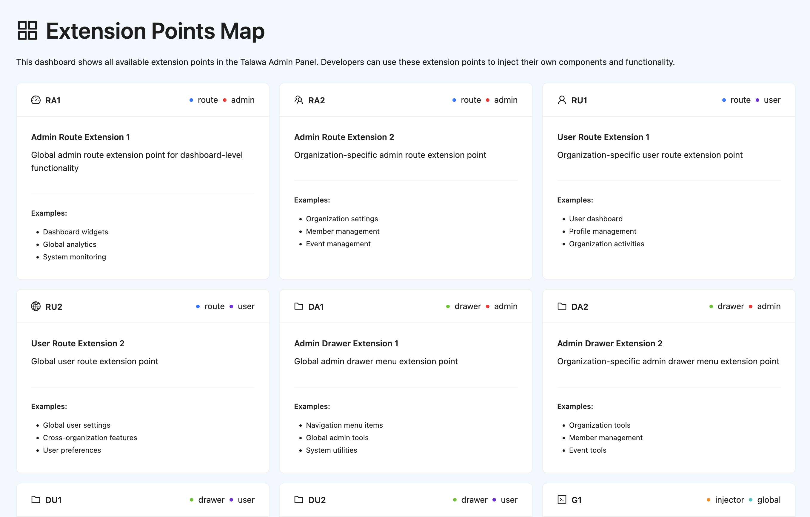

# 🗺️ Plugin Map - Extension Points Explorer

A developer tool plugin that provides a comprehensive visual map of all extension points available in the Talawa Admin Panel, helping plugin developers understand where they can inject their own components and functionality.

## 🚀 Features

### ✅ Core Functionality

- **Extension Point Mapping**: Visual representation of all available extension points
- **Interactive Navigation**: Direct navigation to extension point examples and documentation
- **Real-time Discovery**: Live exploration of extension point availability
- **Code Injection Indicators**: Visual markers showing where components can be injected
- **Developer Documentation**: Comprehensive guides for each extension point

### 🔧 Developer Tools

- **Route Mapping**: Shows all available route extension points (RA1, RA2, RU1, RU2)
- **Drawer Integration**: Displays drawer extension points for navigation (DA1, DA2, DU1, DU2)
- **Injector Visualization**: Maps general injector points for component injection (G1-G5)
- **Context Awareness**: Shows admin vs user context availability
- **Extension Point Testing**: Interactive testing of extension point functionality

### 📊 Extension Point Categories

#### Route Extensions

- **RA1 (Route Admin Global)**: Routes accessible to global administrators
- **RA2 (Route Admin Org)**: Routes accessible to organization administrators
- **RU1 (Route User Org)**: Routes accessible to organization users
- **RU2 (Route User Global)**: Routes accessible to global users

#### Drawer Extensions

- **DA1 (Drawer Admin Global)**: Navigation items for global administrators
- **DA2 (Drawer Admin Org)**: Navigation items for organization administrators
- **DU1 (Drawer User Org)**: Navigation items for organization users
- **DU2 (Drawer User Global)**: Navigation items for global users

#### Injector Extensions

- **G1-G5 (General Injectors)**: Code injection points for component enhancement

## 🏗️ Architecture

### Extension Points Implementation

The plugin demonstrates usage of all major extension points:

```typescript
{
  "extensionPoints": {
    "RA1": [
      {
        "path": "/admin/extension-points/dashboard",
        "component": "ExtensionPointsDashboard"
      }
    ],
    "RA2": [
      {
        "path": "/admin/extension-points/:orgId/organization",
        "component": "ExtensionPointsOrganization"
      }
    ],
    "RU1": [
      {
        "path": "/user/extension-points/:orgId/user",
        "component": "ExtensionPointsUser"
      }
    ],
    "RU2": [
      {
        "path": "/user/extension-points/global",
        "component": "ExtensionPointsGlobal"
      }
    ],
    "DA1": [
      {
        "label": "Extension Points Map",
        "icon": "/src/assets/svgs/plugins.svg",
        "path": "/admin/extension-points/dashboard",
        "order": 1
      }
    ],
    "G1": [
      {
        "injector": "MapIconInjector",
        "description": "Map icon indicator showing G1 extension point availability"
      }
    ]
  }
}
```

### Components

#### Route Components

- **ExtensionPointsDashboard**: Admin dashboard showing all extension points
- **ExtensionPointsOrganization**: Organization-specific extension point explorer
- **ExtensionPointsUser**: User-level extension point interface
- **ExtensionPointsGlobal**: Global extension point overview

#### Injector Components

- **MapIconInjector**: Visual indicators for extension point availability
- **ExtensionPointMarker**: Interactive markers for extension points
- **DeveloperTooltip**: Contextual information for developers

## 🎯 Use Cases

### For Plugin Developers

- **Discovery**: Find all available extension points in one place
- **Documentation**: Access comprehensive guides for each extension point
- **Testing**: Verify extension point functionality before implementing
- **Examples**: See working examples of extension point usage

### For System Administrators

- **Monitoring**: Track which extension points are being used
- **Planning**: Understand system extensibility capabilities
- **Debugging**: Identify extension point conflicts or issues

### For Contributors

- **Learning**: Understand the plugin architecture
- **Contributing**: See where new extension points can be added
- **Documentation**: Access developer resources and guides

## 📋 Installation

### Prerequisites

- Talawa Admin Panel version 2.0.0 or higher
- Node.js 18.0.0 or higher
- React 18.0.0 or higher

### Installation Steps

1. **Via Plugin Store**:

   ```bash
   # Install through Talawa Admin Plugin Store
   # Search for "Plugin Map" and click Install
   ```

2. **Manual Installation**:

   ```bash
   # Clone the plugin to your plugin directory
   cp -r plugin_map src/plugin/available/

   # Restart Talawa Admin
   npm run dev
   ```

3. **From ZIP**:
   ```bash
   # Upload plugin_map.zip through the Plugin Store interface
   # The plugin will be automatically installed and activated
   ```

## 🔧 Configuration

### Extension Point Visibility

The plugin respects user permissions and context:

```typescript
// Admin users see admin extension points
// Regular users see user extension points
// Global context shows global extension points
// Organization context shows org-specific extension points
```

### Developer Mode

Enable developer mode for additional features:

```typescript
// Set in your development environment
process.env.PLUGIN_MAP_DEVELOPER_MODE = "true";
```

## 🚀 Usage

### Accessing the Plugin Map

1. **Admin Dashboard**: Navigate to "Extension Points Map" in admin menu
2. **Organization View**: Access extension points for specific organization
3. **User Interface**: View user-level extension points
4. **Global Overview**: See system-wide extension point usage

### Navigation

- **Click Icons**: Direct navigation to extension point examples
- **Hover Tooltips**: View extension point documentation
- **Context Switching**: Toggle between admin/user contexts
- **Search**: Find specific extension points quickly

## 🔍 Extension Point Reference

### Route Extensions

| ID  | Context      | Description               | Example Path                                  |
| --- | ------------ | ------------------------- | --------------------------------------------- |
| RA1 | Admin Global | Global admin routes       | `/admin/extension-points/dashboard`           |
| RA2 | Admin Org    | Organization admin routes | `/admin/extension-points/:orgId/organization` |
| RU1 | User Org     | Organization user routes  | `/user/extension-points/:orgId/user`          |
| RU2 | User Global  | Global user routes        | `/user/extension-points/global`               |

### Drawer Extensions

| ID  | Context      | Description                   | Purpose                     |
| --- | ------------ | ----------------------------- | --------------------------- |
| DA1 | Admin Global | Global admin navigation       | System-wide admin features  |
| DA2 | Admin Org    | Organization admin navigation | Org-specific admin features |
| DU1 | User Org     | Organization user navigation  | Org-specific user features  |
| DU2 | User Global  | Global user navigation        | System-wide user features   |

### Injector Extensions

| ID  | Description        | Use Case              |
| --- | ------------------ | --------------------- |
| G1  | General Injector 1 | Component enhancement |
| G2  | General Injector 2 | UI element injection  |
| G3  | General Injector 3 | Custom functionality  |
| G4  | General Injector 4 | Analytics integration |
| G5  | General Injector 5 | Third-party services  |

## 🛠️ Development

### Local Development

```bash
# Navigate to plugin directory
cd src/plugin/available/plugin_map

# Install dependencies
npm install

# Start development server
npm run dev
```

### Building for Production

```bash
# Build plugin
npm run build

# Create distribution package
npm run package
```

### Testing

```bash
# Run tests
npm test

# Run with coverage
npm run test:coverage
```

## 📖 API Reference

### Extension Point Registration

```typescript
// Register a new extension point
pluginManager.registerExtensionPoint({
  id: "MY_EXTENSION_POINT",
  type: "route",
  context: "admin",
  path: "/my-custom-route",
  component: "MyComponent",
});
```

### Extension Point Discovery

```typescript
// Get all available extension points
const extensionPoints = pluginManager.getExtensionPoints();

// Get extension points by type
const routeExtensions = pluginManager.getExtensionPoints("route");

// Get extension points by context
const adminExtensions = pluginManager.getExtensionPoints(null, "admin");
```

## 🤝 Contributing

### Development Setup

1. Fork the repository
2. Create a feature branch
3. Make your changes
4. Add tests for new functionality
5. Submit a pull request

### Code Style

- Follow existing TypeScript patterns
- Use semantic commit messages
- Include documentation for new features
- Add unit tests for new components

## 📄 License

This plugin is licensed under the MIT License. See the LICENSE file for details.

## 🔗 Links

- **Documentation**: [Plugin Development Guide](https://github.com/PalisadoesFoundation/talawa-admin/blob/main/PLUGIN_DEVELOPMENT.md)
- **Issues**: [Report Issues](https://github.com/PalisadoesFoundation/talawa-admin/issues)
- **Discussions**: [Community Discussions](https://github.com/PalisadoesFoundation/talawa-admin/discussions)
- **Contributing**: [Contribution Guidelines](https://github.com/PalisadoesFoundation/talawa-admin/blob/main/CONTRIBUTING.md)

## 📊 Screenshots


_The main extension points dashboard showing all available extension points_

---

**Note**: This plugin is primarily a developer tool and is most useful during plugin development and system administration. It provides comprehensive visibility into the Talawa Admin plugin architecture.
